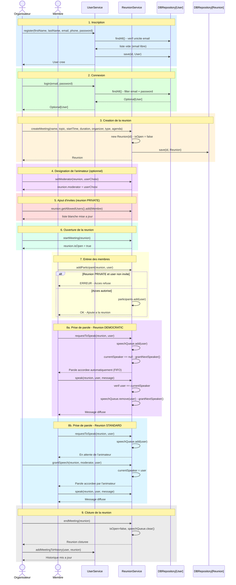

# Diagramme de séquence — BMO

```mermaid
sequenceDiagram
    actor Organisateur
    actor Membre
    participant UserService
    participant ReunionService
    participant DBUser as DBRepository[User]
    participant DBReunion as DBRepository[Reunion]

    rect rgb(220, 240, 255)
        Note over Organisateur, DBUser: 1. Inscription
        Organisateur->>UserService: register(firstName, lastName, email, phone, password)
        UserService->>DBUser: findAll() - verif unicite email
        DBUser-->>UserService: liste vide (email libre)
        UserService->>DBUser: save(id, User)
        UserService-->>Organisateur: User cree
    end

    rect rgb(220, 255, 220)
        Note over Organisateur, DBUser: 2. Connexion
        Organisateur->>UserService: login(email, password)
        UserService->>DBUser: findAll() - filter email + password
        DBUser-->>UserService: Optional[User]
        UserService-->>Organisateur: Optional[User]
    end

    rect rgb(255, 243, 220)
        Note over Organisateur, DBReunion: 3. Creation de la reunion
        Organisateur->>ReunionService: createMeeting(name, topic, startTime, duration, organizer, type, agenda)
        ReunionService->>ReunionService: new Reunion(id) - isOpen = false
        ReunionService->>DBReunion: save(id, Reunion)
        ReunionService-->>Organisateur: Reunion
    end

    rect rgb(245, 220, 255)
        Note over Organisateur, ReunionService: 4. Designation de l'animateur (optionnel)
        Organisateur->>ReunionService: setModerator(reunion, userChoisi)
        ReunionService-->>Organisateur: reunion.moderator = userChoisi
    end

    rect rgb(255, 220, 220)
        Note over Organisateur, ReunionService: 5. Ajout d'invites (reunion PRIVATE)
        Organisateur->>ReunionService: reunion.getAllowedUsers().add(Membre)
        ReunionService-->>Organisateur: liste blanche mise a jour
    end

    rect rgb(220, 255, 240)
        Note over Organisateur, ReunionService: 6. Ouverture de la reunion
        Organisateur->>ReunionService: startMeeting(reunion)
        ReunionService-->>Organisateur: reunion.isOpen = true
    end

    rect rgb(255, 255, 220)
        Note over Membre, ReunionService: 7. Entree des membres
        Membre->>ReunionService: addParticipant(reunion, user)
        alt Reunion PRIVATE et user non invite
            ReunionService-->>Membre: ERREUR - Acces refuse
        else Acces autorise
            ReunionService->>ReunionService: participants.add(user)
            ReunionService-->>Membre: OK - Ajoute a la reunion
        end
    end

    rect rgb(240, 220, 255)
        Note over Membre, ReunionService: 8a. Prise de parole - Reunion DEMOCRATIC
        Membre->>ReunionService: requestToSpeak(reunion, user)
        ReunionService->>ReunionService: speechQueue.add(user)
        ReunionService->>ReunionService: currentSpeaker == null - grantNextSpeaker()
        ReunionService-->>Membre: Parole accordee automatiquement (FIFO)
        Membre->>ReunionService: speak(reunion, user, message)
        ReunionService->>ReunionService: verif user == currentSpeaker
        ReunionService->>ReunionService: speechQueue.remove(user) - grantNextSpeaker()
        ReunionService-->>Membre: Message diffuse
    end

    rect rgb(220, 245, 255)
        Note over Membre, ReunionService: 8b. Prise de parole - Reunion STANDARD
        Membre->>ReunionService: requestToSpeak(reunion, user)
        ReunionService->>ReunionService: speechQueue.add(user)
        ReunionService-->>Membre: En attente de l'animateur
        Organisateur->>ReunionService: grantSpeech(reunion, moderator, user)
        ReunionService->>ReunionService: currentSpeaker = user
        ReunionService-->>Membre: Parole accordee par l'animateur
        Membre->>ReunionService: speak(reunion, user, message)
        ReunionService-->>Membre: Message diffuse
    end

    rect rgb(235, 235, 235)
        Note over Organisateur, DBUser: 9. Cloture de la reunion
        Organisateur->>ReunionService: endMeeting(reunion)
        ReunionService->>ReunionService: isOpen=false, speechQueue.clear()
        ReunionService-->>Organisateur: Reunion cloturee
        Organisateur->>UserService: addMeetingToHistory(user, reunion)
        UserService-->>Organisateur: Historique mis a jour
    end
```
