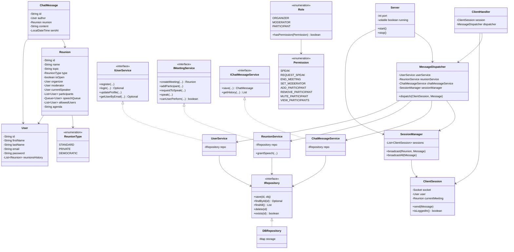
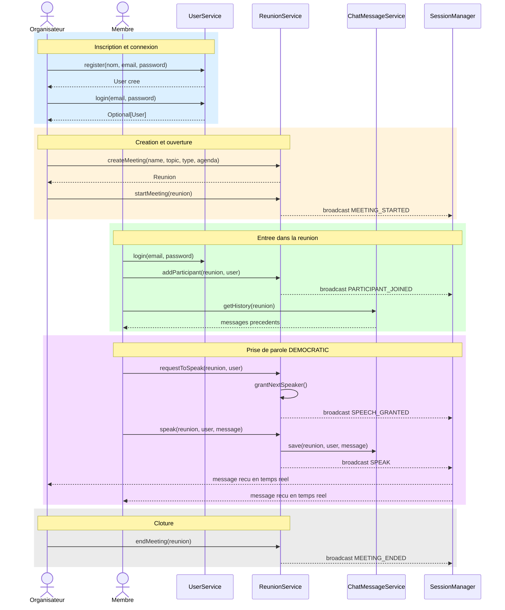

# Documentation Technique — BMO (Bureau de Meetings en ligne)

## Table des matières
1. [Présentation du projet](#1-présentation-du-projet)
2. [Architecture générale](#2-architecture-générale)
3. [Structure des packages](#3-structure-des-packages)
4. [Couche Core — Métier](#4-couche-core--métier)
5. [Couche Network — Réseau](#5-couche-network--réseau)
6. [Protocole de communication](#6-protocole-de-communication)
7. [Diagramme de classes](#7-diagramme-de-classes)
8. [Diagramme de séquence](#8-diagramme-de-séquence)
9. [Prochaines étapes](#9-prochaines-étapes)

---

## 1. Présentation du projet

BMO est la partie **serveur** d'une application client-serveur permettant d'organiser des réunions virtuelles en mode texte. Plusieurs clients peuvent se connecter simultanément et interagir en temps réel.

### Fonctionnalités implémentées
- Inscription et connexion des utilisateurs
- Création et gestion de réunions (Standard, Privée, Démocratique)
- Entrée et sortie de réunion
- Système de prise de parole (manuel ou automatique)
- Diffusion des messages en temps réel à tous les participants
- Historique des messages par réunion
- Système de permissions par rôle (Organisateur, Animateur, Participant)

---

## 2. Architecture générale

Le projet est divisé en deux grandes couches indépendantes :

```
┌─────────────────────────────────────────┐
│             Couche Network              │
│  Server → ClientHandler → Dispatcher   │
│       SessionManager (broadcast)        │
└──────────────────┬──────────────────────┘
                   │ appelle
┌──────────────────▼──────────────────────┐
│              Couche Core                │
│   Services → Interfaces → Models       │
│         IRepository (stockage)          │
└─────────────────────────────────────────┘
```

**Principe clé :** la couche Core ne connaît pas la couche Network. On peut tester toute la logique métier sans démarrer le serveur.

---

## 3. Structure des packages

```
src/
├── Main.java                          Point d'entrée — démarre le serveur
│
├── core/
│   ├── enums/
│   │   ├── Permission.java            Toutes les permissions possibles
│   │   ├── Role.java                  Rôles avec leurs permissions associées
│   │   └── ReunionType.java           Types de réunion (STANDARD, PRIVATE, DEMOCRATIC)
│   │
│   ├── generics/
│   │   ├── IRepository.java           Interface générique CRUD
│   │   └── DBRepository.java          Implémentation en mémoire (HashMap)
│   │
│   ├── interfaces/
│   │   ├── IUserService.java          Contrat du service utilisateur
│   │   ├── IMeetingService.java       Contrat du service réunion
│   │   └── IChatMessageService.java   Contrat du service messages
│   │
│   ├── models/
│   │   ├── User.java                  Modèle utilisateur
│   │   ├── Reunion.java               Modèle réunion
│   │   └── ChatMessage.java           Modèle message de chat
│   │
│   └── services/
│       ├── UserService.java           Logique métier utilisateur
│       ├── ReunionService.java        Logique métier réunion
│       └── ChatMessageService.java    Logique métier messages
│
└── network/
    ├── Server.java                    Accepte les connexions TCP
    │
    ├── protocol/
    │   ├── Action.java                Enum de toutes les actions réseau
    │   └── Message.java               Parse et sérialise les messages
    │
    ├── session/
    │   ├── ClientSession.java         Représente un client connecté
    │   └── SessionManager.java        Gère toutes les sessions + broadcast
    │
    └── handlers/
        ├── ClientHandler.java         Thread dédié à un client
        └── MessageDispatcher.java     Route chaque action vers le bon service
```

---

## 4. Couche Core — Métier

### 4.1 Enums

#### `Permission.java`
Toutes les actions qu'un utilisateur peut effectuer dans une réunion.

| Permission | Description |
|---|---|
| `SPEAK` | Envoyer un message texte |
| `REQUEST_SPEAK` | Demander la parole |
| `END_MEETING` | Clôturer la réunion |
| `SET_MODERATOR` | Nommer un animateur |
| `ADD_PARTICIPANT` | Inviter quelqu'un dans la réunion |
| `REMOVE_PARTICIPANT` | Éjecter un participant |
| `MUTE_PARTICIPANT` | Couper la parole |
| `VIEW_PARTICIPANTS` | Voir la liste des participants |

#### `Role.java`
Chaque rôle encapsule un ensemble de permissions. La méthode `hasPermission(Permission p)` permet de vérifier les droits.

| Rôle | Permissions |
|---|---|
| `ORGANIZER` | Toutes les permissions |
| `MODERATOR` | SPEAK, REQUEST_SPEAK, REMOVE_PARTICIPANT, MUTE_PARTICIPANT, VIEW_PARTICIPANTS |
| `PARTICIPANT` | REQUEST_SPEAK, VIEW_PARTICIPANTS |

#### `ReunionType.java`
| Type | Comportement |
|---|---|
| `STANDARD` | L'animateur choisit manuellement qui parle |
| `PRIVATE` | Accès restreint à une liste d'invités définie par l'organisateur |
| `DEMOCRATIC` | La parole est accordée automatiquement par ordre de demande (FIFO) |

---

### 4.2 Generics

#### `IRepository<T>`
Interface générique pour le stockage. Permet de changer d'implémentation (mémoire, base de données) sans toucher aux services.

```
save(id, obj)      → ajoute ou met à jour
findById(id)       → retourne Optional<T>
findAll()          → retourne List<T>
delete(id)         → supprime
exists(id)         → boolean
```

#### `DBRepository<T>`
Implémentation de `IRepository<T>` utilisant un `HashMap` en mémoire. Utilisée pour simuler une base de données pendant le développement.

---

### 4.3 Models

#### `User.java`
Représente un utilisateur du système.

| Champ | Type | Description |
|---|---|---|
| `id` | String | Identifiant unique (UUID) |
| `firstName` | String | Prénom |
| `lastName` | String | Nom |
| `email` | String | Email (unique, sert de login) |
| `phone` | String | Numéro de téléphone |
| `password` | String | Mot de passe |
| `createdAt` | LocalDateTime | Date de création |
| `updatedAt` | LocalDateTime | Dernière modification |
| `reunionsHistory` | List<Reunion> | Historique des réunions |

#### `Reunion.java`
Représente une réunion virtuelle.

| Champ | Type | Description |
|---|---|---|
| `id` | String | Identifiant unique (UUID) |
| `name` | String | Nom de la réunion |
| `topic` | String | Sujet |
| `startTime` | LocalDateTime | Date et heure de début |
| `durationMinutes` | int | Durée prévue en minutes |
| `organizer` | User | Organisateur (créateur) |
| `moderator` | User | Animateur (organisateur par défaut) |
| `participants` | List<User> | Participants connectés |
| `speechQueue` | Queue<User> | File d'attente de parole |
| `currentSpeaker` | User | Qui a la parole en ce moment |
| `isOpen` | boolean | Réunion ouverte ou non |
| `type` | ReunionType | Type de réunion |
| `allowedUsers` | List<User> | Liste blanche (réunions PRIVATE) |
| `agenda` | String | Ordre du jour |

#### `ChatMessage.java`
Représente un message envoyé en réunion.

| Champ | Type | Description |
|---|---|---|
| `id` | String | Identifiant unique (UUID) |
| `author` | User | Auteur du message |
| `reunion` | Reunion | Réunion concernée |
| `content` | String | Contenu du message |
| `sentAt` | LocalDateTime | Horodatage |

---

### 4.4 Services

#### `UserService` — implémente `IUserService`

| Méthode | Description |
|---|---|
| `register(...)` | Crée un compte, vérifie l'unicité de l'email |
| `login(email, password)` | Retourne `Optional<User>` |
| `updateProfile(...)` | Met à jour les informations de l'utilisateur |
| `addMeetingToHistory(...)` | Ajoute une réunion à l'historique |
| `getUserMeetingsHistory(...)` | Retourne l'historique |
| `getUserByEmail(email)` | Recherche par email |

#### `ReunionService` — implémente `IMeetingService`

| Méthode | Description |
|---|---|
| `createMeeting(...)` | Crée et stocke une nouvelle réunion |
| `getMeetingById(id)` | Retourne `Optional<Reunion>` |
| `getAllMeetings()` | Retourne toutes les réunions |
| `addParticipant(...)` | Ajoute un participant (vérifie la liste blanche si PRIVATE) |
| `removeParticipant(...)` | Retire un participant et nettoie la file de parole |
| `setModerator(...)` | Désigne l'animateur |
| `startMeeting(...)` | Ouvre la réunion |
| `endMeeting(...)` | Clôture et vide la file de parole |
| `requestToSpeak(...)` | Ajoute à la file, accorde automatiquement si DEMOCRATIC |
| `grantSpeech(...)` | L'animateur accorde la parole (STANDARD/PRIVATE) |
| `speak(...)` | Valide que l'utilisateur a la parole, diffuse le message |
| `canUserPerform(...)` | Vérifie si un utilisateur a une permission dans une réunion |

#### `ChatMessageService` — implémente `IChatMessageService`

| Méthode | Description |
|---|---|
| `save(reunion, author, content)` | Persiste un message |
| `getHistory(reunion)` | Retourne tous les messages d'une réunion |

---

## 5. Couche Network — Réseau

### `Server.java`
Point d'entrée du serveur TCP. Écoute sur un port, accepte les connexions entrantes et crée un thread dédié par client.

### `ClientSession.java`
Représente la connexion d'un client. Contient :
- Le socket de connexion
- Le `BufferedReader` / `PrintWriter` pour lire/écrire
- L'utilisateur connecté (`null` tant que non authentifié)
- La réunion courante (`null` si pas dans une réunion)

### `SessionManager.java`
Gère l'ensemble des sessions actives. Thread-safe grâce à `CopyOnWriteArrayList`.

| Méthode | Description |
|---|---|
| `add(session)` | Enregistre une nouvelle connexion |
| `remove(session)` | Supprime à la déconnexion |
| `broadcast(reunion, message)` | Envoie à tous les participants d'une réunion |
| `broadcastAll(message)` | Envoie à tous les clients connectés |

### `ClientHandler.java`
`Runnable` — un thread par client. Lit les messages ligne par ligne, les passe au `MessageDispatcher`. Gère la déconnexion proprement.

### `MessageDispatcher.java`
Reçoit un `Message` parsé et appelle le bon handler selon l'`Action`. Contient toute la logique de routage et les vérifications d'authentification.

### `Message.java`
Format texte simple séparé par `|`.

```
// Sérialisation
SPEAK|meetingId|Bonjour tout le monde!

// Désérialisation
Message.parse("SPEAK|meetingId|Bonjour") → Message(SPEAK, ["meetingId", "Bonjour"])
```

---

## 6. Protocole de communication

Toutes les communications utilisent du **TCP brut** avec des messages texte séparés par `|`.

### Actions Client → Serveur

| Action | Paramètres | Description |
|---|---|---|
| `REGISTER` | firstName\|lastName\|email\|phone\|password | Créer un compte |
| `LOGIN` | email\|password | Se connecter |
| `CREATE_MEETING` | name\|topic\|duration\|type\|agenda | Créer une réunion |
| `GET_MEETINGS` | — | Lister toutes les réunions |
| `GET_MEETING_DETAILS` | meetingId | Détails d'une réunion |
| `UPDATE_MEETING` | meetingId\|topic\|duration\|agenda | Modifier une réunion |
| `ADD_ALLOWED_USER` | meetingId\|email | Inviter dans une réunion PRIVATE |
| `JOIN_MEETING` | meetingId | Rejoindre une réunion |
| `LEAVE_MEETING` | — | Quitter la réunion courante |
| `START_MEETING` | meetingId | Ouvrir une réunion |
| `END_MEETING` | meetingId | Clôturer une réunion |
| `SET_MODERATOR` | meetingId\|userId | Nommer un animateur |
| `REQUEST_SPEAK` | meetingId | Demander la parole |
| `GRANT_SPEECH` | meetingId\|userId | Accorder la parole (animateur) |
| `SPEAK` | meetingId\|message | Envoyer un message |
| `GET_HISTORY` | meetingId | Récupérer l'historique du chat |

### Réponses Serveur → Client

| Type | Format | Description |
|---|---|---|
| Succès | `OK\|ACTION\|params...` | Réponse directe à une action |
| Erreur | `ERROR\|ACTION\|message` | Erreur sur une action |
| Broadcast | `BROADCAST\|type\|params...` | Événement temps réel |

### Événements Broadcast

| Événement | Paramètres | Déclencheur |
|---|---|---|
| `BROADCAST\|SPEAK` | firstName\|lastName\|message | Quelqu'un parle |
| `BROADCAST\|PARTICIPANT_JOINED` | firstName\|lastName | Quelqu'un rejoint |
| `BROADCAST\|PARTICIPANT_LEFT` | firstName\|lastName | Quelqu'un part |
| `BROADCAST\|SPEECH_GRANTED` | firstName\|lastName | Parole accordée |
| `BROADCAST\|MODERATOR_SET` | firstName\|lastName | Nouvel animateur |
| `BROADCAST\|MEETING_STARTED` | name | Réunion ouverte |
| `BROADCAST\|MEETING_ENDED` | name | Réunion clôturée |

---

## 7. Diagramme de classes



---

## 8. Diagramme de séquence



---

## 9. Prochaines étapes

### Client JavaFX (à venir)

Le client JavaFX se connecte au serveur via un simple `Socket` Java. Il doit :

1. **Se connecter** au serveur (`Socket("adresse", 8080)`)
2. **Lancer un thread d'écoute** pour recevoir les broadcasts en temps réel
3. **Afficher les messages** dans un composant `TextArea` via `Platform.runLater()`
4. **Appeler `GET_HISTORY`** au `JOIN_MEETING` pour afficher l'historique

### Exposition avec ngrok

Pour connecter des clients extérieurs au serveur local :

```bash
ngrok tcp 8080
```

ngrok fournit une adresse publique du type `0.tcp.ngrok.io:XXXXX`. Les autres membres du groupe remplacent `localhost` par cette adresse dans leur client.

### Pour une vraie base de données (futur)

Grâce à l'interface `IRepository<T>`, il suffira de créer une classe `SqlRepository<T>` et de remplacer `DBRepository` dans `Main.java` — sans toucher aux services.
